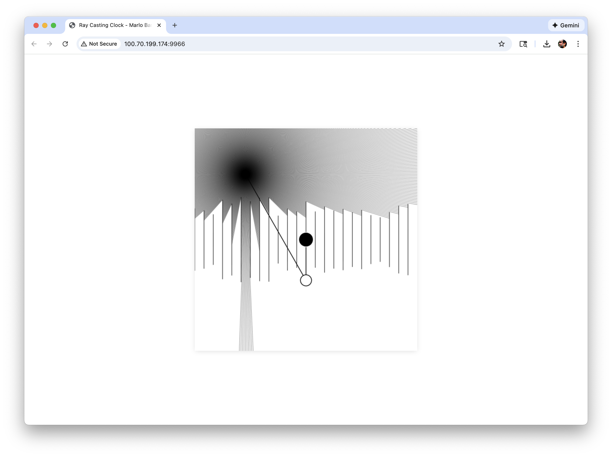

# Ray Casting Clock

**Concept and Programming by Marlo Barrios Solano**



**[🌐 Live App](https://marlonbarrios.github.io/ray_casting_clock/)**

A generative art piece that combines ray casting visualization with real-time clock functionality. The sketch creates a dynamic, interactive visualization where rays emanate from a moving point that follows the current time, casting light rays that interact with vertical obstacles representing the 24 hours of the day.

## Features

- **Real-time Ray Casting**: 720 rays cast in all directions (0.5° increments)
- **Time-based Animation**: The particle position follows the current time
- **24 Hour Obstacles**: Vertical lines representing each hour of the day
- **Minimalist Aesthetic**: Thin black lines on white background
- **Canvas Sketch Integration**: Built with canvas-sketch v0.7.6 for export capabilities

## Technical Details

- **Canvas Size**: 512 x 512 pixels
- **Framework**: canvas-sketch v0.7.6 with p5.js
- **Ray Resolution**: 0.5° increments (720 rays total)
- **Export Settings**: 300 DPI, 2x pixel ratio

## Running the Project

### Canvas-Sketch Version (Recommended)

```bash
npm install
npm start
```

This will start a local server and open the sketch in your browser at `http://localhost:9966`

### Browser Version

Simply open `index.html` in your web browser.

## Export

To export high-resolution images:

```bash
npm run export
```

## Controls

- The visualization updates in real-time based on your system clock
- Press `S` or `s` to save the canvas (browser version only)
- For canvas-sketch version, use `npm run export` for high-res exports

## Structure

- `sketch-canvas-sketch.js` - Main canvas-sketch version
- `sketch.js` - Original p5.js browser version
- `particle.js` - Particle class with ray casting logic
- `ray.js` - Ray class for line intersection calculations
- `boundary.js` - Boundary/wall class for obstacles

## License

Creative work by Marlo Barrios Solano

